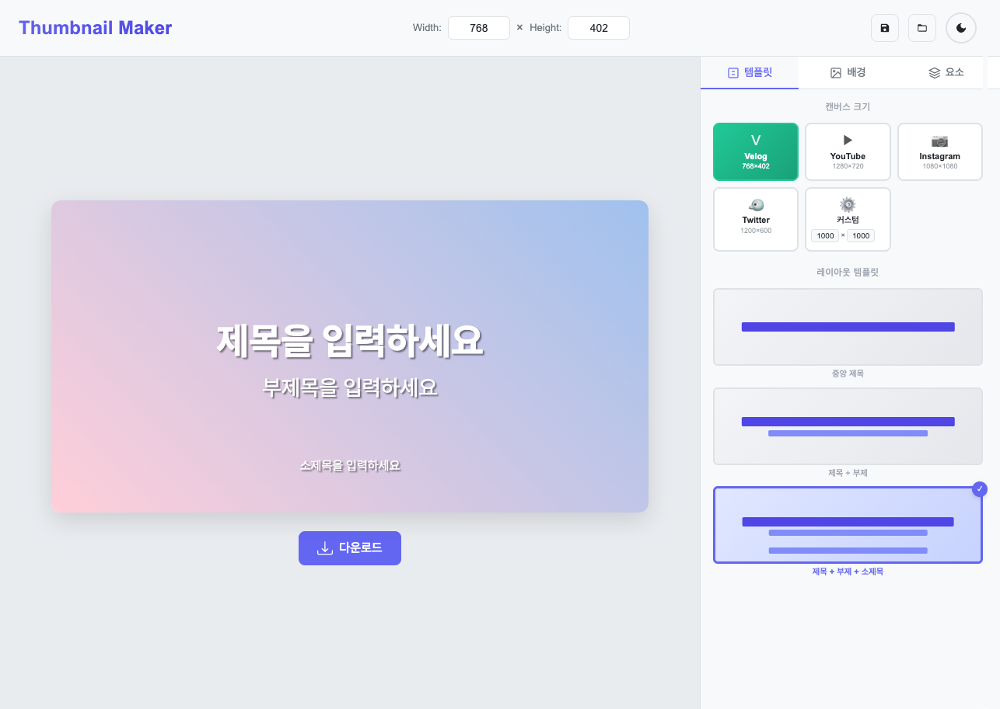

# Thumbnail Maker

## 📌 소개

Velog나 개발 블로그, 유튜브 등의 플랫폼에서 쉽게 썸네일을 제작할 수 있는 도구입니다.

- **개발자**: [Reo](https://reo91004.com)
- **GitHub**: [reo91004/thumbnail-maker](https://github.com/reo91004/thumbnail-maker)
- **라이브 데모**: [Thumbnail Maker 사용하기](http://reo91004.com/thumbnail-maker)

## ✨ 주요 기능

### 1. 📐 캔버스 크기 설정

- **플랫폼별 프리셋**: Velog, YouTube, Instagram, Twitter 등 주요 플랫폼 권장 크기
- **커스텀 크기**: 원하는 크기로 자유롭게 설정 가능

### 2. 🎨 배경 설정

- **프리셋 색상**: 16가지 엄선된 색상 팔레트
- **그라데이션**: 6가지 아름다운 그라데이션 프리셋
- **이미지 업로드**: 커스텀 배경 이미지 지원 (localStorage 저장)
- **랜덤 생성**: 랜덤 색상/그라데이션 자동 생성

### 3. 📝 요소 관리

- **텍스트 추가**: 제목, 부제목, 본문 텍스트 추가
- **스타일 편집**:
  - 폰트 선택 (Pretendard, Noto Sans KR 등 한글 폰트 지원)
  - 크기, 굵기, 색상 조절
  - 정렬, 그림자 효과
- **위치 잠금**: 실수로 요소가 이동되지 않도록 잠금 기능
- **드래그 & 리사이즈**: 직관적인 요소 조작

### 4. 🎯 레이아웃 템플릿

- 미리 정의된 레이아웃으로 빠른 시작
- 중앙 제목, 제목+부제, 제목+부제+소제목 등

### 5. 💾 저장 및 내보내기

- **프로젝트 저장**: 작업 내용을 브라우저에 저장
- **이미지 다운로드**: PNG 형식으로 고화질 다운로드
- **다크 모드**: 눈의 피로를 줄이는 다크 테마 지원

## 🛠 기술 스택

- **Frontend**: React 18.2.0
- **Styling**: Sass, CSS Modules
- **Canvas**: html2canvas
- **Drag & Drop**: react-rnd
- **Icons**: react-icons
- **Font**: CDN을 통한 웹폰트 (Pretendard, Noto Sans KR 등)

## 📸 스크린샷

### 메인 화면

- 직관적인 UI/UX
- 실시간 미리보기
- 다양한 편집 도구

### 주요 기능

- 템플릿 선택
- 배경 커스터마이징
- 텍스트 편집

## 🤝 기여하기

버그 리포트, 기능 제안, Pull Request 모두 환영합니다!

1. Fork the Project
2. Create your Feature Branch (`git checkout -b feature/AmazingFeature`)
3. Commit your Changes (`git commit -m 'Add some AmazingFeature'`)
4. Push to the Branch (`git push origin feature/AmazingFeature`)
5. Open a Pull Request

## 📄 라이선스

MIT License

## 📧 연락처

- Website: [reo10004.com](https://reo10004.com)
- GitHub: [@reo91004](https://github.com/reo91004)

---

Made with ❤️ by <a href="https://reo10004.com">reo10004</a>

